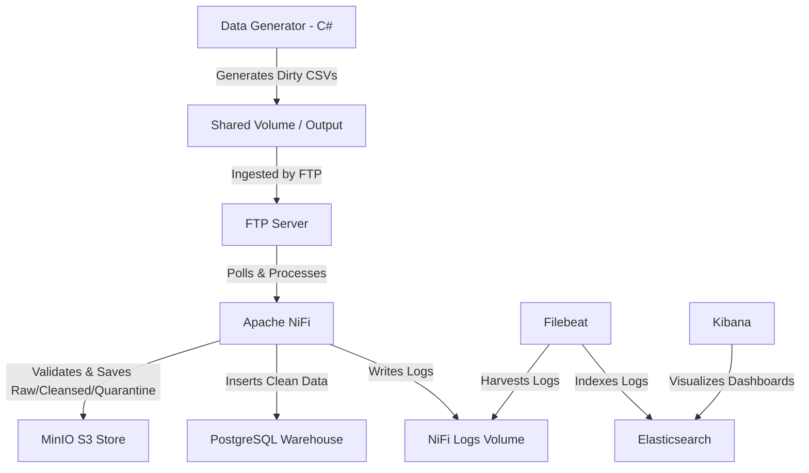

# Big Data ETL & Synthetic Data Pipeline

This repository contains an end-to-end data engineering pipeline designed to generate, ingest, clean, store, and monitor synthetic "dirty" datasets. 

It is comprised of a custom **C# Data Generator**, an **Apache NiFi** ingestion and processing server (integrated with Azure AD/Entra ID SSO), a **PostgreSQL Data Warehouse**, a **MinIO S3-compatible Object Store**, and a logging stack (**Elasticsearch**, **Kibana**, and **Filebeat**).

---

## Architecture Flow



---

## Services & Components

### 1. Data Generator (C# / .NET 8)
A high-performance C# application that writes randomized record batches. It intentionally injects anomalies to test ETL pipeline resilience:
* **Duplicate records** to test deduplication mechanisms.
* **Corrupt string formatting** (special characters, bad text encoding).
* **Corrupted numeric values** (nulls, non-numeric strings in numeric fields).
* Configurable via environment variables or [.env](file:///.env).

### 2. Ingress & Processing
* **FTP Server**: Simulates a landing zone where external datasets are dropped. Shares a local output directory with the Data Generator.
* **Apache NiFi**: Orchestrates the ETL pipeline. Fetches data from FTP, performs validation, splits records, routes clean data to Postgres, and splits dirty files to MinIO.
  * **OIDC Auth**: Integrated with Azure AD (Microsoft Entra ID) for single sign-on.
  * **Logback Integration**: Configured to route flow-specific console messages directly to a custom `nifi-canvas.log`.

### 3. Storage Layer
* **MinIO**: Acts as the cloud landing zone (S3 protocol). Automatically provisioned with:
  * Buckets: `raw`, `cleansed`, `quarantine`.
  * Users: `dev-user` (developer access) and `auditor-user` (read-only audit access).
  * Policies: Custom IAM definitions limiting access to specific buckets.
* **PostgreSQL**: Serving as the relational analytics data warehouse.

### 4. Telemetry & Monitoring (ELK)
* **Filebeat**: Monitors NiFi log directories, applying filters to index errors, warnings, and canvas events.
* **Elasticsearch**: Central log indexing engine.
* **Kibana**: Dashboard UI to monitor pipeline anomalies and operational errors.

---

## Getting Started

### Prerequisites
* [Docker & Docker Compose](https://www.docker.com/products/docker-desktop/)
* [.NET 8 SDK](https://dotnet.microsoft.com/en-us/download/dotnet/8.0) (optional, for local generator testing)

### 1. Configure the Environment
Copy or configure the environment variables inside [.env](file:///.env):
* Root MinIO configurations
* Elasticsearch/Kibana credentials
* Azure AD OIDC Tenant, Client, and Secret values

### 2. Start the Pipeline
Run the following command to download, build, and deploy the entire environment in the background:
```bash
docker compose up -d
```
Docker Compose is configured with healthchecks, meaning containers will start sequentially in a stable manner (e.g., NiFi starts only after Postgres is ready, Kibana starts only after Elasticsearch is online).

---

## Service Ports & Entrypoints

| Service | Protocol/UI Port | Credentials (Default / Configurable) | Description |
| :--- | :--- | :--- | :--- |
| **Apache NiFi** | HTTPS `https://localhost:8443/nifi/` | Azure AD (OIDC Client login) | ETL Orchestrator |
| **MinIO Console** | HTTP `http://localhost:9001` | `minioadmin` / `minioadmin123` | Storage UI |
| **Kibana** | HTTP `http://localhost:5601` | `kibana_system` / `.env` config | Logs UI |
| **PostgreSQL** | Port `5433` | `nifi_admin` / `.env` config | Warehouse DB |
| **Elasticsearch** | Port `9200` | Port access only | Indexing API |
| **FTP Server** | Port `21` | `nifi` / `nifi_pass` | FTP Endpoint |
